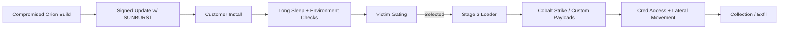

# APT29’s SUNBURST: What Actually Happened and How I’d Hunt It Today

Version: 1.1  
Last updated: 2025-09-01  
Author: @1rhino2

Why this write-up
I wanted a single, practical summary of the SolarWinds/SUNBURST compromise that I could hand to a responder, an exec, or my future self on a Wednesday at 2 a.m. It’s not exhaustive, but it’s opinionated: what mattered, what stood out, and what to do first.

TL;DR
- SUNBURST rode in via a signed SolarWinds Orion DLL and waited (a long time) before carefully calling home.
- The operators were disciplined: heavy victim gating, minimal noise, and selective second-stage deployment (TEARDROP/RAINDROP -> Cobalt Strike).
- If you still have historical Orion telemetry, hunt for BusinessLayerHost talking to non-SolarWinds domains, followed by quiet service creations and in-memory loaders.
- Prefer behavioral detections; IOCs rotated constantly.

---

Scope
- Threat actor: APT29 (aka Cozy Bear/NOBELIUM/UNC2452)
- Malware families: SUNBURST (backdoor), TEARDROP/RAINDROP (droppers), Cobalt Strike beacons, custom loaders
- Platforms: Windows; SolarWinds Orion servers and downstream enterprise AD environments
- Timeframe: 2020–2021 primary exposure; long tail in some environments
- Objective: Strategic intel collection (careful victim selection)

---

How the intrusion actually unfolded (plain-English)
- Build compromise: The Orion build pipeline was tainted so that legitimate, signed updates shipped with a backdoored DLL.
- Dormancy: SUNBURST didn’t sprint; it slept—randomized long delays—to blend with normal Orion ops.
- Gating and selection: The code exhaustively checked its surroundings (security tools, domains, enterprise “interesting-ness”). Many environments never got a second stage.
- Staging: Where targets looked worthwhile, operators used small loaders (TEARDROP/RAINDROP) to get a Cobalt Strike beacon in-memory and move on from there.
- Ops hygiene: Rotating infra, “look like Orion” network patterns, service abuse, and living-off-the-land kept footprints faint.

A quick visual


What stood out to me
- Patience as a feature: The delayed beaconing wasn’t just stealth—it throttled the blast radius.
- Quiet triage: They burned fewer bridges by not lighting every box on fire.
- Signed plausibility: Ship it like a vendor; get trusted like a vendor.
- Service abuse + in-memory loads: Classic EDR pain points, still effective when done with restraint.
- Hunting is different than detection here: Don’t wait on one signature or one domain—go after behaviors around Orion hosts.

---

Malware behavior summary (concise)
SUNBURST (in-tainted Orion DLL)
- Lives inside Orion service processes (e.g., SolarWinds.BusinessLayerHost.exe)
- Uses Orion’s legit persistence; no extra run keys needed initially
- Long randomized sleep; enumerates tools, domains, and indicators of “don’t touch”
- HTTP(S) C2 with custom headers/patterns designed to look routine for Orion
- Per-victim tasking; not everyone gets a payload

Second-stage loaders (TEARDROP/RAINDROP)
- Decrypt and reflectively load Cobalt Strike beacons (in-memory)
- Frequently paired with new/modified Windows services to bootstrap quietly

Post-exploitation
- Cobalt Strike for lateral movement, discovery, and exfil
- Living-off-the-land: PowerShell, WMI, WinRM, schtasks, certutil, AD queries

---

MITRE ATT&CK (at a glance)
- Initial Access: Supply Chain Compromise (T1195)
- Execution: Command/Scripting (T1059), Service Execution (T1569)
- Persistence: Legit service piggyback, Scheduled Tasks (T1053)
- Privilege Escalation: Token Impersonation (T1134), Service abuse
- Defense Evasion: Signed Binary Proxy (T1218), Disable/impair defenses (T1562), In-memory payloads (T1620)
- Credential Access: LSASS dump/handle abuse (T1003.001)
- Lateral Movement: Remote Services (T1021) including WMI/WinRM/RDP
- C2: Web Protocols (T1071.001)
- Collection/Exfil: Staging (T1074), Exfil over C2 channel (T1041)

---

Hunting playbook you can run this week

Microsoft Defender for Endpoint / Sentinel (KQL)
1) Orion process talking to non-vendor endpoints
```kusto
DeviceNetworkEvents
| where Timestamp > ago(90d)
| where InitiatingProcessFileName in~ ("SolarWinds.BusinessLayerHost.exe", "SolarWinds.BusinessLayerHostx64.exe")
| where isnotempty(RemoteUrl)
| where RemoteUrl !contains_cs "solarwinds"
| summarize urls=make_set(RemoteUrl), cnt=dcount(RemoteUrl) by DeviceName, InitiatingProcessFileName
| where cnt > 0
```

2) Suspicious service creations near Orion activity
```kusto
DeviceEvents
| where Timestamp > ago(30d)
| where ActionType == "ServiceInstalled"
| where AdditionalFields !has_cs "SolarWinds"
| project Timestamp, DeviceName, InitiatingProcessFileName, ServiceName, FolderPath
```

3) Likely credential access attempts (LSASS)
```kusto
DeviceProcessEvents
| where Timestamp > ago(30d)
| where FileName in~ ("rundll32.exe","procdump.exe","taskmgr.exe","wmic.exe","powershell.exe")
| where ProcessCommandLine has_any ("lsass", "MiniDump", "comsvcs.dll")
| summarize attempts=count() by DeviceName, FileName, ProcessCommandLine
```

Splunk SPL
1) Orion outbound anomalies
```spl
index=win* (process_name="SolarWinds.BusinessLayerHost*.exe")
| stats values(dest) as dests values(dest_domain) as domains by host process_name
| where NOT mvfind(domains, "solarwinds")
```

2) New services (non-SolarWinds) on Orion hosts
```spl
index=wineventlog sourcetype=WinEventLog:System EventCode=7045
| search NOT ImagePath="*SolarWinds*"
| table _time host ServiceName ServiceFileName ServiceType StartType AccountName
```

Sigma (YAML)
```yaml
title: Orion Process Outbound to Non-SolarWinds Domains
id: 3e1c0a3b-0c5f-4a0b-9a7e-1234567890ab
status: experimental
logsource:
  category: network_connection
  product: windows
detection:
  selection:
    Image|endswith:
      - \SolarWinds.BusinessLayerHost.exe
      - \SolarWinds.BusinessLayerHostx64.exe
  filter_vendor:
    DestinationHostname|contains:
      - solarwinds
      - orion
  condition: selection and not filter_vendor
fields:
  - Image
  - DestinationHostname
  - DestinationIp
  - DestinationPort
level: high
```

YARA (Heuristic; prefer memory scans on Orion processes)
```yara
rule SUNBURST_Heuristic_Mem
{
  meta:
    author = "SOC"
    description = "Heuristics matching SUNBURST-adjacent staging"
    reference = "Public reporting"
  strings:
    $s1 = "avsvmcloud" ascii nocase
    $s2 = "Orion Improvement Business Layer" ascii
  condition:
    uint16(0) == 0x5A4D and 1 of ($s*)
}
```

Triage questions I actually ask
- Did any Orion host reach out to domains that aren’t SolarWinds—and what happened on-box in the next 2 hours?
- Were any new services created on or near those timestamps? Who spawned them?
- Do you see memory-only beacons or transient processes with odd parentage?
- Did LSASS get touched by tools that aren’t your standard dumpers or EDR responders?
- Which service accounts did Orion have access to, and where can they log in?

---

Representative IOCs (validate freshness before enforcement)
Hashes (SUNBURST-tainted DLLs; sample)
- b91ce2fa41029f6955bff20079468448
- 2c4a910a1299cdae… (truncated)
- 32519b83a8c6b5e9… (truncated)

Historical domains (partial)
- avsvmcloud[.]com
- appsync-api[.]eu-west-1[.]avsvmcloud[.]com
- digitalcollege[.]org
- freescanonline[.]com

Sample IPs (historic, rotated often)
- 13.59.205.66
- 54.193.127.66
- 3.130.253.23

Artifacts to look for
- SolarWinds.BusinessLayerHost.exe making HTTP(S) requests to non-SolarWinds infra
- New services with non-vendor binaries after Orion updates
- Prefetch anomalies tied to Orion-hosted processes

Note: These IOCs age quickly; rely on behaviors and your own environment’s telemetry first.

---

Response checklist (condensed, practical)
1) Scope
- Enumerate all Orion installs/versions; map systems reachable from those servers.
- Pull 90 days of Orion process network telemetry; isolate non-SolarWinds egress.

2) Contain
- Isolate Orion servers showing suspicious outbound or service creation.
- Block known bad infra with caution; don’t tip hand if you need further scoping.

3) Eradicate & harden
- Rebuild Orion from trusted media; rotate relevant creds and tokens.
- Remove unauthorized services, scheduled tasks, and loaders; validate with memory scans.

4) Validate
- Run post-cleanup hunts for living-off-the-land patterns (WMI, WinRM, lateral toolmarks).
- Baseline new Orion network behavior; add detections for drift.

---

What I’d fix long-term
- Treat vendor software as privileged code: SBOM + code signing verification + build attestation where possible.
- Push memory-first analytics for long-lived services (like Orion).
- Make service creation a tier-1 detection with human review on high-value hosts.
- Keep a “vendor-behavior allowlist” and alarm on deltas.

---

References (good starting points)
- Microsoft Threat Intelligence: Solorigate/SUNBURST deep dives and mitigation guidance
- Mandiant/FireEye: Initial disclosure and TEARDROP/RAINDROP analysis
- CISA Alert AA20-352A: APT compromise of government and private sector orgs
- CrowdStrike and Volexity blogs on post-exploitation tradecraft in affected tenants

Acknowledgements
Thanks to the DFIR and TI community whose public reporting made this synthesis possible.

Changelog
- 1.0 (2025-09-01): Initial draft.

Maintainer
- @1rhino2 — PRs welcome.
